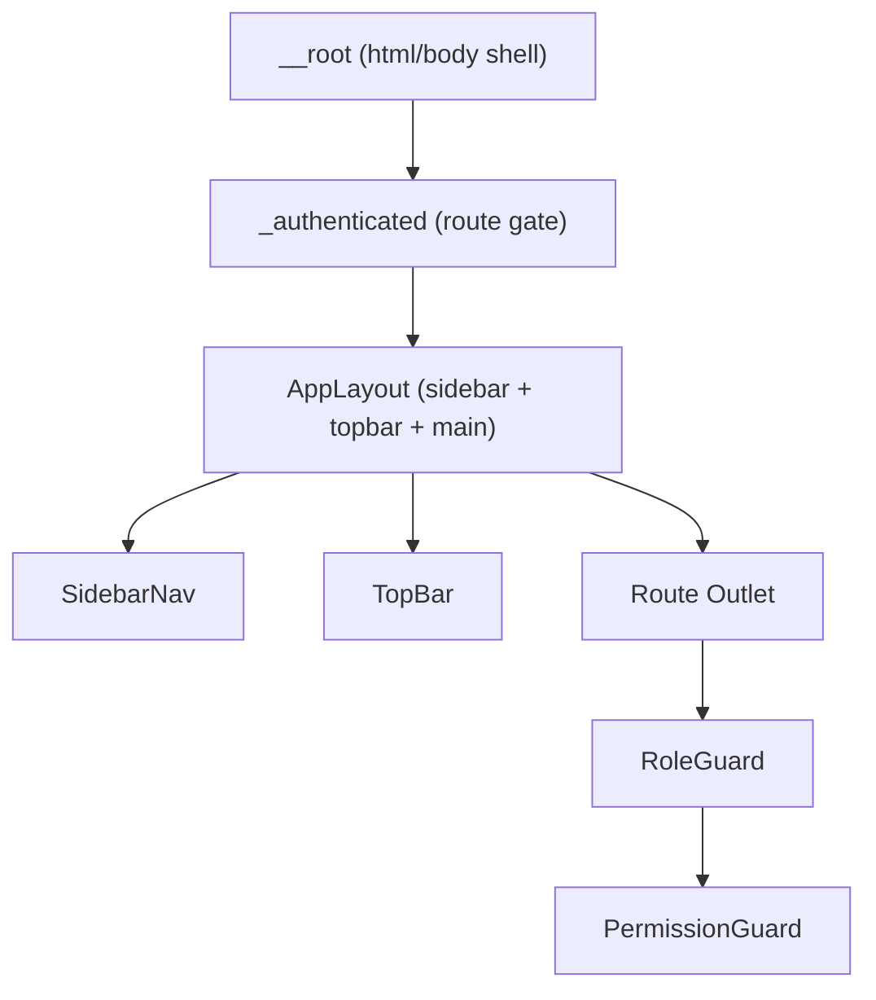
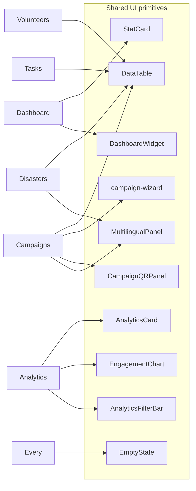
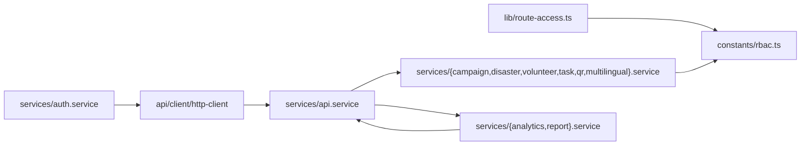

# Component & Module Dependency

## Component tree (high level)

## Feature modules and their reusable widgets

## Module dependency graph

Rules:
- Components never call `httpClient` directly — always via a service.
- Services never call another service's HTTP wrapper — always via `apiService`.
- Analytics is a single facade; no per-module analytics service.
- Guards, cache keys, and route access rules read from `RBAC` — never re-declare permissions inline.
